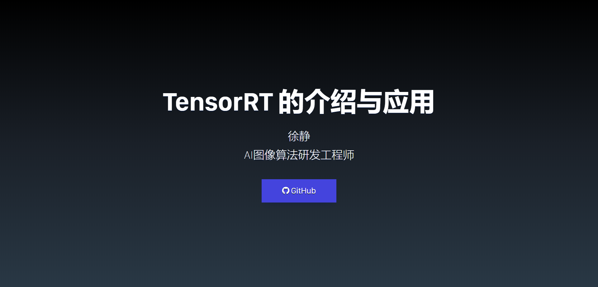
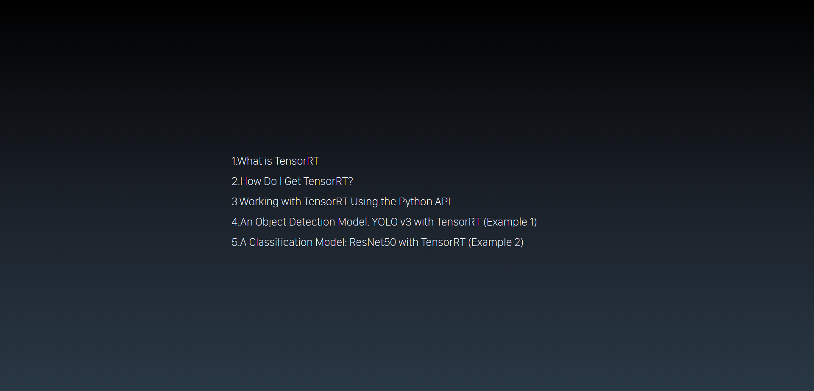
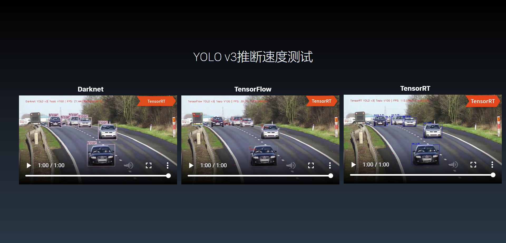
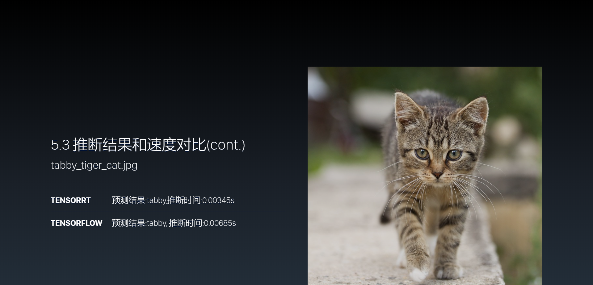

## TensorRT的介绍及应用

------

**:sparkles::sparkles::sparkles:感谢小伙伴的关注, 源码奉上！！！:sparkles::sparkles::sparkles:**

:white_check_mark:： 
链接：https://pan.baidu.com/s/1ZJy9Vkeo6y1w3icknSxLlA 
提取码：usxg

------

**Xu Jing**

本项目介绍了深度学习中TensorRT对TensorFlow,ONNX,Caffe,Pytorch等框架的推断加速，TensorRT提供了C++ API和Python API,它解决了GPU模型推断加速的优化瓶颈；目前TensorRT的版本为7.x.x,TensorRT并不对以上框架的所有操作均支持。

在线slide的地址：<https://dataxujing.github.io/TensorRT_CV/index.html#slide=1>

在线B站视频教程： <https://www.bilibili.com/video/av86802077>

内容：

1. What is TensorRT
2. How Do I Get TensorRT?
3. Working with TensorRT Using the Python API
4. An Object Detection Model: YOLO v3 with TensorRT (Example 1)
5. A Classification Model: ResNet50 with TensorRT (Example 2)

## ~~由于源码占用空间较大，请索要源码的小伙伴发邮件到274762204@qq.com，我会在看到的第一时间回复大家，谢谢支持和理解！~~
